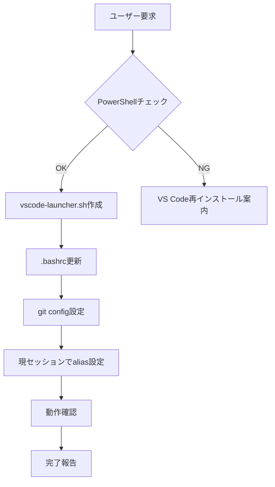

# Claude Code パターン認識ガイド: VS Codeセットアップ

## ユーザーの要求パターンと対応

### パターン1: 「nanoがうざい」系
- "nanoじゃなくてVS Codeで"
- "CUIアプリじゃなくて"
- "ホスト側のエディタで"

**即座に**: PowerShell経由VS Code起動スクリプトを実装

### パターン2: 「editコマンドが動かない」系
- "edit test.txtしたけど開かない"
- "VS Codeが起動しない"

**確認事項**:
```bash
# 1. PowerShellでcodeが使えるか
powershell.exe -Command "Get-Command code"

# 2. エイリアスが設定されているか
alias | grep edit
```

### パターン3: 「Claude Codeが実行すると開かない」系
- "あなたが実行すると俺のところに届かない"
- "例外が握りつぶされる"

**説明**: これが核心的問題。必ずPowerShell経由の解決策を提示。

## よくある失敗と回避策

### 失敗1: 単純なcode設定
```bash
# ❌ これだけではダメ
export EDITOR="code --wait"
alias edit="code"
```
**理由**: Claude Code実行時に出力が捕獲される

### 失敗2: update-alternativesに頼る
```bash
# ❌ パスワード問題で詰まる
sudo update-alternatives --set editor $(which code)
```
**理由**: sudoパスワード入力で止まる

### 失敗3: 複雑なWSL統合
```bash
# ❌ 過度に複雑
wsl.exe code
cmd.exe /c code
```
**理由**: パス変換が面倒、エラーが出やすい

## 最速実装フロー



## デバッグコマンド集

```bash
# launcher動作確認
bash -x /home/ubuntu/vscode-launcher.sh test.txt

# PowerShell実行確認
powershell.exe -Command "echo 'PowerShell OK'"

# パス変換確認
wslpath -w /home/ubuntu/test.txt

# プロセス確認
ps aux | grep code
```

## ユーザーコミュニケーション

### 初回説明
「WSL環境でVS Codeをデフォルトエディタにします。ただし、私（Claude Code）が直接実行すると出力が私側で処理されてしまうため、PowerShell経由で起動する仕組みを作ります。」

### 進捗報告
- Phase 1: PowerShell起動スクリプト作成
- Phase 2: エディタ設定更新
- Phase 3: 動作確認

### 完了報告
「設定完了！`edit ファイル名`でVS Codeが開きます。新しいターミナルでお試しください。」

## 成功指標

1. ✅ /home/ubuntu/vscode-launcher.sh が存在
2. ✅ .bashrcにエイリアス設定済み
3. ✅ git config core.editorが設定済み
4. ✅ ユーザーが満足

---
*このガイドに従えば、どのClaude Codeインスタンスも確実にユーザーのニーズを満たせます。*